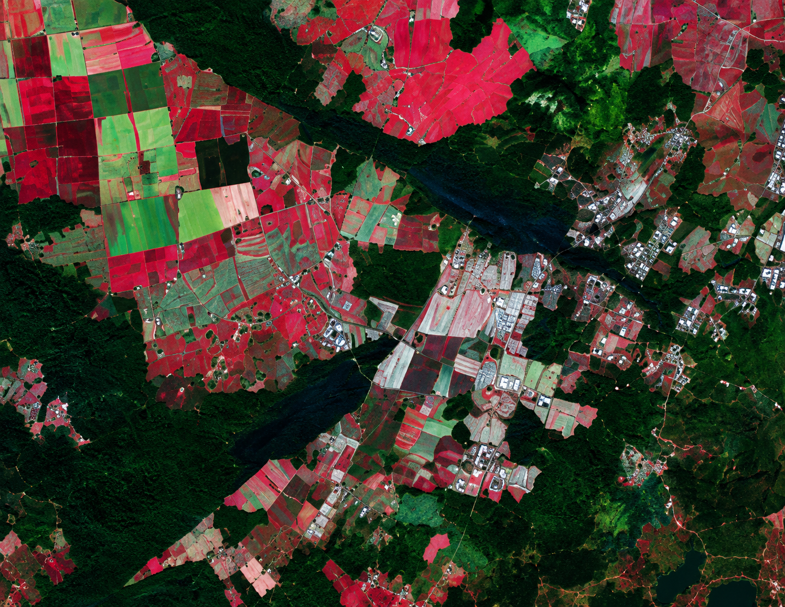

# Machine-Learning-for-Remote-Sensing
An introductory machine learning project focused on remote sensing data analysis and land-cover classification. The study covers data preprocessing, feature exploration, model training, and performance comparison across multiple machine learning algorithms. XGBoost achieved the best overall performance with an accuracy of 91.61%.

---

# Remote-Sensing-ML-Case-Study

A beginner Machine Learning case study focused on land-cover classification using remotely sensed spectral data. This project was developed as part of my early Machine Learning learning journey to understand data preprocessing, exploratory analysis, model training, and comparative evaluation of classical Machine Learning algorithms.

---

## Overview

Remote sensing datasets contain spectral information collected by sensors across multiple wavelength bands. These spectral signatures can be used to identify and classify different land-cover categories.

In this project, multiple Machine Learning algorithms were trained and evaluated on a spectral dataset containing 36 spectral bands and 6 land-cover classes.

The primary objective was to explore how different Machine Learning models perform on remote sensing classification tasks.

---

## Dataset Information

<p align="center">
  
</p>

### Dataset Statistics

| Property          | Value                      |
| ----------------- | -------------------------- |
| Total Samples     | 6,435                      |
| Spectral Features | 36                         |
| Target Classes    | 6                          |
| Problem Type      | Multi-Class Classification |

### Data Description

Each sample represents a remotely sensed observation characterized by spectral reflectance values across 36 bands.

Target labels correspond to different land-cover categories.

### Class Distribution

| Class | Samples |
| ----- | ------: |
| 1     |    1533 |
| 2     |     703 |
| 3     |    1358 |
| 4     |     626 |
| 5     |     707 |
| 7     |    1508 |

---

## Project Workflow

1. Data Loading
2. Data Preprocessing
3. Exploratory Data Analysis (EDA)
4. Feature Inspection
5. Model Training
6. Performance Evaluation
7. Comparative Analysis

---

## Machine Learning Models Evaluated

* Logistic Regression
* Support Vector Machine (SVM)
* Neural Network (MLP)
* Random Forest
* XGBoost

---

## Results

| Model               | Accuracy (%) |
| ------------------- | -----------: |
| Logistic Regression |        85.39 |
| SVM                 |        86.01 |
| Neural Network      |        77.86 |
| Random Forest       |        91.38 |
| XGBoost             |    **91.61** |

### Best Performing Model

**XGBoost** achieved the highest classification accuracy of **91.61%**.

---

## Technologies Used

* Python
* Pandas
* NumPy
* Scikit-Learn
* XGBoost
* Matplotlib

---

## Repository Structure

```text
Remote-Sensing-ML-Case-Study/
│
├── dataset/
│   └── merged_dataset.csv
│
├── code/
│   └── classify.py
│
├── images/
│   └── remote_sensing_img.png
│
├── requirements.txt
├── .gitignore
└── README.md
```

---

## Learning Outcomes

This project helped me understand:

* Machine Learning workflow
* Data preprocessing techniques
* Feature-based classification
* Model evaluation metrics
* Comparative analysis of ML algorithms
* Practical application of Machine Learning on remote sensing data

---

## Disclaimer

This repository is intended as a Machine Learning case study and learning project. The focus is on applying and comparing classical Machine Learning algorithms rather than developing a novel remote sensing methodology or deep learning architecture.

---

## Author

**Manoj Kumar Sunkara**

Artificial Intelligence & Machine Learning
